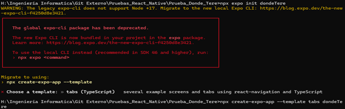
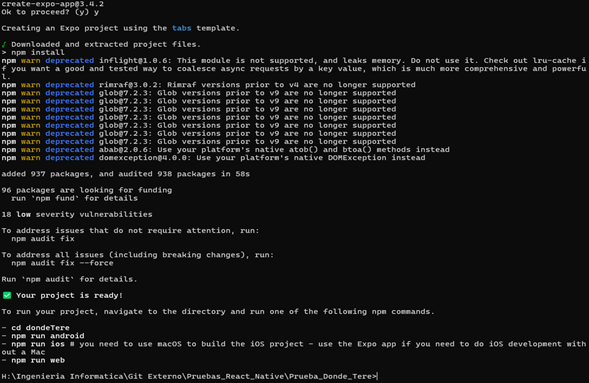
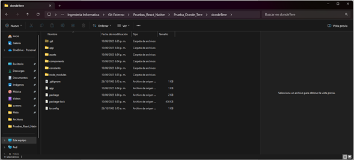
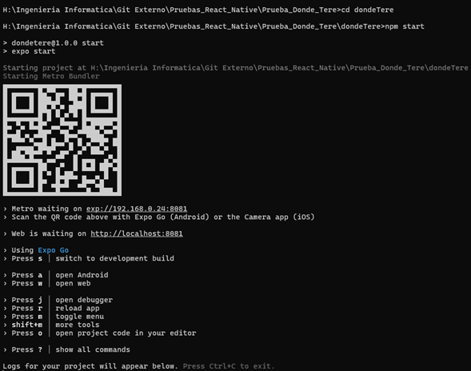
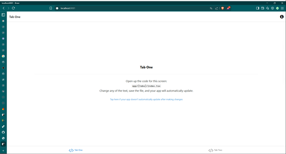

# 🚀 ¿Cómo crear una app de React Native con Expo?

Este documento explica paso a paso cómo crear una aplicación utilizando **React Native con Expo**, usando un template con navegación entre pantallas y soporte para **TypeScript**.

---

## ✅ Requisitos previos

- Tener instalado **Node.js**  
  👉 Recomendado: última versión estable desde [nodejs.org](https://nodejs.org/)

---

## ⚙️ Intento inicial

Inicialmente se intentó crear la app usando `expo-cli`, pero esta herramienta está **obsoleta**. Por lo tanto, se decidió utilizar el nuevo comando recomendado por Expo.



---

## 🎯 Creación de la app con template de pestañas (tabs)

Se seleccionó el template `tabs`, que incluye navegación entre pantallas y TypeScript listo para usar.

```bash
npx create-expo-app --template tabs dondeTere
```

Aparecerá lo siguiente en la terminal:

```bash
Need to install the following packages:
create-expo-app@3.4.2
Ok to proceed? (y) y
Creating an Expo project using the tabs template.
```



---

## 📁 Estructura y ejecución del proyecto

Una vez creada la app, debes dirigirte a la carpeta generada (dondeTere, en este caso):

```bash
cd dondeTere
```



### ▶️ Para ejecutar la app:

Como el enfoque principal es el desarrollo web, se utiliza el siguiente comando:

```bash
npm start
```

Este comando abre **Expo DevTools** en la ventana de comanddos y permite:

- Ver la app en un navegador web
- Escanear el código QR con la app **Expo Go** en Android o iOS para probarla directamente en el celular



---

## 📱 Visualización de la App

### En iOS:


### En la Web:



---

## 📝 Notas finales

Este template de Expo es ideal para comenzar proyectos modernos en React Native con navegación y TypeScript integrados desde el inicio.

Si quieres personalizar más el entorno, puedes agregar librerías como `react-navigation`, `axios`, `redux`, etc.

---

## ✍️ Autor

Creado por Rubén Velasco (Velasco-Dev)
📅 Fecha de creación: 10/06/2025
